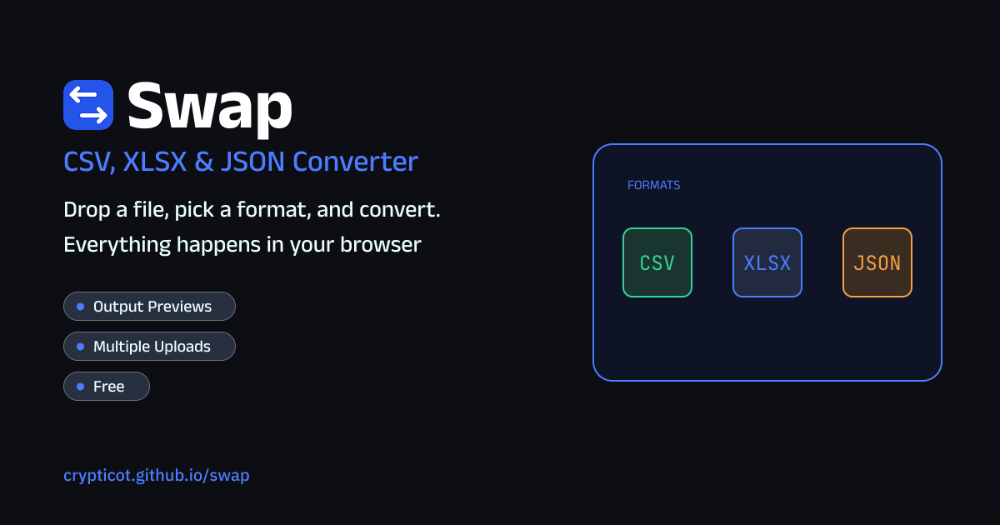

# Swap

Swap is a file converter for CSV, XLSX, and JSON that runs entirely in your browser. Drop in one file or many, pick a target format for each, and download the result. Your files are read on your device and never sent to a server, so there is no upload, no account, and no size limit set by a service.

**[Live Demo](https://crypticot.github.io/swap/)**



---

## Why this exists

Converting a spreadsheet should not mean pasting your data into a website you know nothing about. Most online converters upload the file, ask you to wait, and then bury the download behind a sign-up. The task itself is small: read a file, reshape it, write it back out in another format.

Swap does exactly that and nothing else. The whole app is a single file with no backend, so the data in your files stays in the tab you opened. There is nothing to install, nothing to configure, and no step between dropping a file and getting the converted one back.

---

## What it does

- **Three formats, any direction**: CSV, XLSX (including older .xls files), and JSON. Each file has its own target menu, so you can turn a CSV into a workbook and a JSON file into a CSV in the same batch. The default target is XLSX for a CSV, and CSV for everything else
- **Batch conversion**: add as many files as you like, then use Convert all, or convert them one at a time. Download all gives you a single file directly when there is only one, and a ZIP when there are several
- **Type detection**: when a CSV is read, numbers and true/false values are detected and kept as real values instead of plain text, so they arrive in Excel and JSON with the right type
- **JSON flattening**: an array of objects becomes rows, a single object becomes one row, and nested fields turn into `parent.child` columns. Lists of plain values are joined with semicolons, and lists of objects become `items[0].name` style columns
- **JSON to JSON**: converting JSON to JSON reformats the original structure with your chosen indentation and does not flatten it
- **Side-by-side preview**: open the preview on any file to see the input next to the output. Tables show the first 8 rows and 8 columns and say how much more there is. JSON is shown with syntax colors
- **Clear errors**: a file that cannot be read, such as invalid JSON, is marked as failed and shows the reason in its preview instead of stopping the rest of the batch
- **Session counts and history**: a small counter shows how many files are queued, converted, and failed. History keeps the last 30 conversions, with file name, size, and time, and it has a Clear button
- **Settings**: light or dark theme (it follows your system on the first visit), six accent colors, CSV delimiter (comma, semicolon, or tab), JSON indentation (2 spaces, 4 spaces, or minified), and the sheet name used for XLSX output
- **Works on phones**: the layout is a single column and the preview stacks on narrow screens

---

## Tech stack

Built in vanilla HTML, CSS, and JavaScript, in one file. Just open `index.html`.

- No framework and no build step
- [SheetJS](https://sheetjs.com/) reads and writes Excel workbooks, [PapaParse](https://www.papaparse.com/) reads and writes CSV, and [JSZip](https://stuk.github.io/jszip/) builds the ZIP for Download all. All three load from cdnjs
- Browser storage (`localStorage`) keeps your theme, accent color, and conversion history on your device
- Google Fonts: Anek Telugu (interface) + JetBrains Mono (code), with system fonts as the fallback if they cannot load

---

## Running it locally

```bash
git clone https://github.com/crypticot/swap.git
cd swap
```

Open `index.html` in any modern browser. No dependencies to install and no server required. The first load needs an internet connection to fetch the three libraries above.

---

## A few design decisions worth knowing

**Why every conversion goes through rows.** Whatever you drop in, Swap first turns it into a list of rows with named columns, and every output is written from that list. That gives one path for every pair of formats instead of six separate converters, and it means a change to how a format is read or written happens in one place. JSON to JSON is the one exception, because it keeps your original structure.

**Why JSON is flattened with dotted names.** A spreadsheet has no place for nested data, so something has to give when JSON becomes CSV or XLSX. Swap turns `{"user": {"name": "Ada"}}` into a `user.name` column, which keeps every value and keeps the path back to where it came from. When you convert JSON to JSON, nothing needs to flatten, so nothing does.

**Why only the first sheet of a workbook is read.** A CSV or a JSON array has one table, and a workbook can have many. Reading the first sheet keeps the result predictable and matches what most people mean when they convert a spreadsheet. Output workbooks always contain one sheet, and you can name it in Settings.

**Why history stores no file contents.** History is a log of what you converted, not a copy of it. It saves only the file name, size, and time, so nothing from inside your files is written to browser storage. Clear removes it in one click.

**Why the files never leave the browser.** Parsing, conversion, and zipping all happen in the page, so a file goes from your disk to your memory and back to your disk. The tradeoff is that very large files are limited by your browser's memory instead of a server's.

---

## Built by

**Chidubem Ojukwu** · [Portfolio](https://crypticot.github.io/cotworks-portfolio/) · [LinkedIn](https://linkedin.com/in/ojukwuii)

Created by COTworks. A single-file tool for anyone who needs to convert a spreadsheet without uploading it anywhere.
